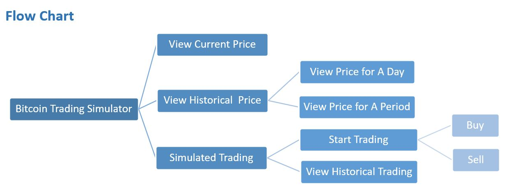

# Bitcoin Trading Simulator
-- CS521 Information Structures with Python Final Project

## Overview

Bitcoin trading simulator is a Python project that simulates Bitcoin trading by implementing two elementary functions on Bitcoin trading: price viewing and simulated trading. It enables users to invest Bitcoin without spending real money.

## Solution

Using the divide-and-conquer strategy, the problem can be divided into the following aspects regarding the function need to implement:

1. View Current Price

Get the current datetime to request the current price form API.

2. View Historical Price

+ View for A Day 

Prompt for a valid date to get historical price data from file and show a candlestick chart.

+ View for A Period

Prompt for a valid period to get historical price data from file and show a candlestick chart.

3. Simulated trading

+ Start Trading 
 
Set the initial trading data by getting last trading history from file before trading.

Buy: add Bitcoin amount and value, subtract cash amount, and record in file.

Sell: add cash amount, subtract Bitcoin amount and value, and record in file.

+ View Historical Trading 
 
Get all trading history data from file and show in in specified format.

## Flow Chart 

## Run Instruction

1. Install third-party modules

+ Pandas

Install from https://pandas.pydata.org/pandas-docs/stable/getting_started/install.html

+ mplfinance

Download and install from https://pypi.org/project/mplfinance/

2. Run "bitcoin_trading_simulator.py"
